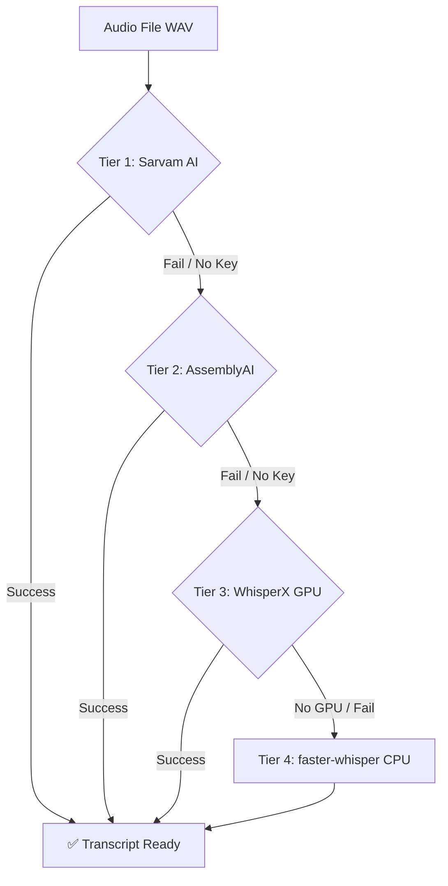

<div align="center">

<h1>
  
</h1>

<p>
  <strong>Self-hosted · Privacy-first · Zero cloud required</strong><br/>
  Record meetings, transcribe speech, generate AI summaries, ask questions, and email PDF minutes — entirely on your local network.
</p>

<p>
  
  
  
  
  
  
  
  
  
  
</p>

<p>
  
  
  
  
</p>

</div>

---

## 📋 Table of Contents

- [Why This Project?](#-why-this-project)
- [Features](#-features)
- [Live Demo Screenshots](#-live-demo-screenshots)
  - [Docker Startup](#-docker-startup)
  - [Home Page](#-home-page)
  - [Create Meeting](#-create-meeting)
  - [Share Invite](#-share-invite)
  - [Join Meeting](#-join-meeting)
  - [Meeting Room](#-meeting-room)
  - [Active Speaker & Screen Share](#-active-speaker--screen-share)
  - [Recording](#-recording)
  - [Transcript](#-transcript)
  - [AI Summary](#-ai-summary)
  - [Email Digest](#-email-digest)
  - [Ask AI](#-ask-ai)
  - [PDF Minutes](#-pdf-minutes)
  - [Gmail — Email Received](#-gmail--email-received)
- [Project Flow](#-project-flow)
- [Technology Stack](#-technology-stack)
- [Architecture](#-architecture)
- [Project Structure](#-project-structure)
- [How It Works — Full Flow](#-how-it-works--full-flow)
  - [Step 1: Creating a Meeting](#step-1-creating-a-meeting)
  - [Step 2: Joining the Room](#step-2-joining-the-room)
  - [Step 3: Recording Audio](#step-3-recording-audio)
  - [Step 4: Transcription — 4-Tier Pipeline](#step-4-transcription--the-4-tier-pipeline)
  - [Step 5: Aggregating Transcripts](#step-5-aggregating-transcripts-from-multiple-participants)
  - [Step 6: AI Summary](#step-6-ai-summary)
  - [Step 7: Ask AI (RAG)](#step-7-ask-ai-rag)
  - [Step 8: Speaker Analytics](#step-8-speaker-analytics)
  - [Step 9: PDF and Email](#step-9-pdf-and-email)
- [File Explanations](#-file-explanations)
- [API Endpoints](#-api-endpoints)
- [Data Storage](#-data-storage)
- [Technology Choices — Why Not X?](#-technology-choices--why-not-x)
- [Security](#-security)
- [Error Handling](#-error-handling)
- [Installation & Setup](#-installation--setup)
- [Environment Variables](#-environment-variables)
- [Future Scope](#-future-scope)

---

## 🧠 Why This Project?

Current meeting tools like **Zoom**, **Google Meet**, or **Microsoft Teams** require a paid subscription to access AI features like transcripts and summaries. More critically, they send all your audio and data to servers owned by third-party companies. For organisations that handle private information — like hospitals, schools, or government offices — this is a serious privacy risk.

Even when these tools are used, transcripts are often inaccurate for **Indian speakers of English**, or for meetings where people switch between Hindi and English. AI summaries are generic and fail to capture key decisions.

> **There is no free, open-source, privacy-first solution that a student or small organisation can set up on their own computer without technical expertise. This project fills that gap.**

---

## ✨ Features

| Feature | Description |
|---|---|
| 🎥 **Video Conferencing** | Browser-based video/audio meetings via LiveKit WebRTC — no app install for participants |
| 🎙️ **Audio Recording** | Per-participant recording using MediaRecorder API (`audio/webm;codecs=opus`) |
| 📝 **4-Tier Transcription** | Sarvam AI → AssemblyAI → WhisperX (GPU) → faster-whisper (CPU) — always produces output |
| 👥 **Speaker Diarization** | Identifies who said what and when, per segment |
| 🤖 **AI Summary** | Structured summaries: purpose, key takeaways, action items, decisions, next steps |
| 💬 **Ask AI (RAG)** | Ask natural-language questions about your meeting — answered from the actual transcript |
| 📊 **Speaker Analytics** | Speaking time, word count, pace, top keywords per participant |
| 📄 **PDF Minutes** | 8-section meeting minutes generated automatically with ReportLab |
| 📧 **Email Digest** | SMTP email with PDF attachment; dry-run mode if not configured |
| 🔒 **100% Private** | Everything runs on your LAN — no audio, transcript, or summary leaves your network |
| 🐳 **One-Command Setup** | Docker Compose bundles all 5 services; `./start.sh` handles certs and IP detection |

---

## 📸 Live Demo Screenshots

### 🐳 Docker Startup

`./start.sh` detects your LAN IP, generates TLS certificates, writes `livekit.yaml`, and starts all 5 Docker services automatically.

<p align="center">
  
</p>

<p align="center">
  
</p>

Once all containers are running, the script prints your LAN IP and a checklist for certificate installation on Android/iOS and SMTP configuration.

<p align="center">
  
</p>

---

### 🏠 Home Page

The landing page greets users with a clean product hero. No technical jargon — just a single **"Start a Free Meeting"** button and a concise explanation of the three steps.

<p align="center">
  
</p>

Scrolling down reveals the **"How MeetingAI Works"** section showing the three-step flow: Create & Share → Talk Normally → Get Your Summary.

<p align="center">
  
</p>

The features grid highlights all AI capabilities — Speaker Transcript, AI Summary in Seconds, Ask Anything, PDF Meeting Minutes, Email to the Whole Team.

<p align="center">
  
</p>

---

### ➕ Create Meeting

Click **"Create Meeting"** and fill in a title and your name. The backend generates an 8-character meeting ID and a shareable join URL instantly.

<p align="center">
  
</p>

---

### 📤 Share Invite

After creating the meeting, the invite page shows the join URL with a **"Copy Invite Link"** button. Share it via WhatsApp, email, or any messaging app — participants need nothing installed.

<p align="center">
  
</p>

The link can be sent to any device on the same LAN via WhatsApp or any other channel.

<p align="center">
  
</p>

---

### 🚪 Join Meeting

Any participant opens the link in their browser and clicks **"Join Meeting"** — no account, no download, no plugin.

<p align="center">
  
</p>

---

### 📹 Meeting Room

The meeting room shows each participant in their own video tile. The host sees the full control bar: Mute, Camera, Share Screen, and Start Recording. The right panel shows the Participants list and AI Transcript tabs.

**Single participant view:**

<p align="center">
  
</p>

**Two participants connected:**

<p align="center">
  
</p>

---

### 🔊 Active Speaker & Screen Share

The active speaker is detected automatically and their tile is highlighted with a **green border**. The right panel also shows a live **"Speaking"** badge next to the active participant's name.

<p align="center">
  
</p>

Participants can share their screen by clicking **Share Screen** — the browser's native tab/window/screen picker opens.

<p align="center">
  
</p>

---

### 🔴 Recording

The host clicks **Start Recording**. Each participant records their own audio stream locally via the browser's `MediaRecorder` API. The bottom bar switches to a red **Stop Recording** button. A hint reminds the Teacher to record on their own device.

<p align="center">
  
</p>

The **"Speaking"** label updates in real time beside the active participant while recording is in progress.

<p align="center">
  
</p>

When recording stops, the WebM audio file is uploaded and FFmpeg converts it to 16kHz mono WAV immediately. The right panel shows **"Processing…"** while transcription runs.

<p align="center">
  
</p>

---

### 📝 Transcript

Once the 4-tier transcription pipeline completes, the full transcript appears in the **Transcript** tab — each segment labelled with the speaker's name and colour-coded.

<p align="center">
  
</p>

> **Note**
> The transcript is produced even without internet. If Sarvam AI and AssemblyAI are unavailable, WhisperX or faster-whisper runs locally on CPU — no GPU required.

---

### 🤖 AI Summary

Switch to the **Summary** tab. Click **"Generate AI Summary"** to produce a structured summary of the meeting, or **"Generate Meeting Minutes PDF"** to create a downloadable PDF.

<p align="center">
  
</p>

The AI summary is displayed inline — with the meeting purpose, key takeaways, action items, and decisions extracted from the transcript.

<p align="center">
  
</p>

---

### 📧 Email Digest

Switch to the **Email** tab. Enter one or more recipient email addresses (comma or space separated). The PDF is automatically attached and ready to send.

<p align="center">
  
</p>

Multiple recipients can be added at once.

<p align="center">
  
</p>

> **Tip**
> If SMTP credentials are not configured, the system saves the email as JSON to `storage/email_logs/` — useful for local testing without a mail server.

---

### 💬 Ask AI

The **Ask AI** tab lets participants type any question about the meeting. Suggested questions appear as chips. The answer is retrieved using RAG — only the actual transcript content is used, never hallucinated.

<p align="center">
  
</p>

---

### 📄 PDF Minutes

The generated PDF is an 8-section professional document: title page, meeting info, participants, executive summary, key topics, action items, decisions, and a speaker-wise transcript table.

**PDF cover page:**

<p align="center">
  
</p>

**Speaker-wise transcript table inside the PDF:**

<p align="center">
  
</p>

---

### 📬 Gmail — Email Received

The digest email arrives in the recipient's Gmail inbox with the meeting summary, key takeaways, action items, and a **"Download Meeting Minutes PDF"** button.

**Gmail inbox — email received:**

<p align="center">
  
</p>

**Email body — AI Meeting Intelligence header with summary:**

<p align="center">
  
</p>

**Email body — key takeaways, topics and next steps:**

<p align="center">
  
</p>

**Email body — PDF download button and attachment:**

<p align="center">
  
</p>

---

## 🔄 Project Flow

```mermaid
flowchart LR
    A[🏠 Create Meeting] --> B[🔗 Share Invite Link]
    B --> C[👥 Participants Join via Browser]
    C --> D[🔴 Record Audio]
    D --> E[📤 Upload WebM → WAV]
    E --> F[🧠 4-Tier Transcription]
    F --> G[📝 Speaker Diarization]
    G --> H[🤖 AI Summary]
    H --> I[💬 Ask AI - RAG]
    I --> J[📊 Speaker Analytics]
    J --> K[📄 Generate PDF]
    K --> L[📧 Send Email Digest]
```



**4-Tier Transcription Fallback:**



---

## 🛠️ Technology Stack

| Layer | Technology | Purpose |
|---|---|---|
| **Frontend** | React 18 + Vite + JSX | UI components, meeting room, all panels |
| **Backend** | Python 3.11 + FastAPI | REST API, business logic, background tasks |
| **WebRTC** | LiveKit (self-hosted) | Real-time video/audio SFU |
| **Database** | SQLite / JSON files | Meeting records, transcripts, summaries |
| **Cache / Queue** | Redis (provisioned) | Ready for Celery task queue |
| **Relational DB** | PostgreSQL (provisioned) | Ready for migration from JSON storage |
| **Transcription T1** | Sarvam AI (Saaras v3) | Indian languages (Hindi, Tamil, Telugu…) |
| **Transcription T2** | AssemblyAI | English with built-in speaker diarization |
| **Transcription T3** | WhisperX + pyannote | Local GPU transcription + diarization |
| **Transcription T4** | faster-whisper (int8) | CPU-only fallback — always works |
| **AI Summary** | OpenAI GPT-4o-mini / Sarvam-M / Gemini 1.5 Flash | Structured meeting summaries |
| **AI Q&A** | RAG over transcript | Ask questions answered from transcript |
| **PDF** | ReportLab | 8-section meeting minutes, no external deps |
| **Email** | Python smtplib + STARTTLS | HTML digest + PDF attachment |
| **TLS / Certs** | mkcert | LAN HTTPS without browser warnings |
| **Containerization** | Docker + Docker Compose | 5-service one-command deployment |
| **Audio Processing** | FFmpeg | WebM → 16kHz mono WAV conversion |
| **Auth (JWT)** | PyJWT | LiveKit room tokens, scoped per room |
| **Config** | pydantic-settings | Typed env vars with defaults |

---

## 🏗️ Architecture

```
┌─────────────────────────────────────────────────────────────┐
│                     Browser (React)                          │
│  Landing │ Create │ Join │ Meeting Room │ Post-Meeting       │
│                          │                                   │
│  LiveKit React SDK ──────┼──── Vite Proxy /livekit          │
│  Fetch API calls ────────┼──── Vite Proxy /api              │
└──────────────────────────┼──────────────────────────────────┘
                           │  HTTPS :5173 (LAN)
            ┌──────────────┼──────────────────┐
            │              │                  │
     ┌──────▼──────┐  ┌────▼──────┐   ┌──────▼──────┐
     │  FastAPI    │  │  LiveKit  │   │  Vite Dev   │
     │  :8000      │  │  :7880    │   │  Server     │
     │  10 routers │  │  WebRTC   │   │  :5173      │
     │  9 services │  │  SFU      │   │             │
     └──────┬──────┘  └───────────┘   └─────────────┘
            │
     ┌──────▼──────────────────────────────┐
     │           storage/                  │
     │  meetings.json  transcripts/        │
     │  summaries/     recordings/         │
     │  audio/         events/             │
     │  pdfs/          email_logs/         │
     └─────────────────────────────────────┘
```

Five Docker services: `postgres`, `redis`, `livekit`, `backend`, `frontend` — all starting from `docker-compose up`.

---

## 📁 Project Structure

```
meeting-ai-platform/
├── start.sh                 # Run this to start everything
├── docker-compose.yml       # 5 services: frontend, backend, livekit, postgres, redis
├── livekit.yaml             # Auto-generated by start.sh — don't edit manually
├── .env.example             # Copy this to .env and fill in your API keys
│
├── backend/
│   ├── Dockerfile
│   ├── requirements.txt
│   └── app/
│       ├── main.py          # FastAPI app, CORS config, router registration
│       ├── core/
│       │   └── config.py    # All environment variables with defaults
│       ├── api/             # Route handlers — thin layer, no business logic here
│       │   ├── meetings.py
│       │   ├── recordings.py
│       │   ├── transcripts.py
│       │   ├── ai.py
│       │   ├── speakers.py
│       │   ├── pdf.py
│       │   ├── email_digest.py
│       │   ├── livekit.py
│       │   ├── participants.py
│       │   └── meetings_merge.py
│       ├── schemas/         # Pydantic models for request/response validation
│       │   ├── meeting.py
│       │   ├── ai.py
│       │   ├── livekit.py
│       │   └── participant.py
│       └── services/        # All actual business logic lives here
│           ├── meeting_service.py
│           ├── transcription_service.py
│           ├── ai_service.py
│           ├── ask_ai_service.py
│           ├── llm_service.py
│           ├── livekit_service.py
│           ├── pdf_service.py
│           ├── email_service.py
│           ├── diarization_service.py
│           ├── meeting_aggregation_service.py
│           └── participant_event_service.py
│
├── frontend/
│   ├── Dockerfile
│   ├── package.json
│   ├── vite.config.js
│   └── src/
│       ├── main.jsx
│       ├── services/
│       │   ├── api.js       # Every backend call goes through here
│       │   └── livekit.js   # LiveKit room setup
│       └── components/
│           ├── AISummaryPanel.jsx
│           ├── AskAIPanel.jsx
│           ├── ConnectionStatus.jsx
│           ├── ControlsBar.jsx
│           ├── EmailDigestPanel.jsx
│           ├── ParticipantGrid.jsx
│           ├── ParticipantTile.jsx
│           ├── RecordingControls.jsx
│           ├── SpeakerPanel.jsx
│           └── TranscriptPanel.jsx
│
└── backend/storage/         # All data saved here as JSON/binary files
    ├── meetings.json
    ├── transcripts/
    ├── meetings/            # Merged transcripts (multiple participants combined)
    ├── summaries/
    ├── recordings/          # Original .webm audio files
    ├── audio/               # Converted .wav files (what Whisper actually reads)
    ├── pdfs/
    ├── email_logs/
    ├── events/              # Who joined, who spoke, when recording started
    └── metadata/            # Which recording belongs to which participant
```

---

## 🔬 How It Works — Full Flow

### Step 1: Creating a Meeting

You hit **"New Meeting"** on the frontend. The React app calls `POST /api/meetings/create`. The backend generates an 8-character ID (`str(uuid4())[:8]`), builds a join URL like `https://192.168.1.10:5173/meeting/a1b2c3d4`, saves it to `meetings.json`, and sends it back. That's it — a meeting is just an ID and some metadata at this point.

---

### Step 2: Joining the Room

Before anyone can join, they need a LiveKit JWT token. The frontend calls `POST /api/livekit/token` with the room name and participant name. The backend signs a JWT with claims like `roomJoin: true`, `canPublish: true` and sends it back. The browser then connects to LiveKit using that token via `wss://192.168.1.10:5173/livekit` — which goes through the Vite proxy to `ws://livekit:7880` inside Docker.

> **Note**
> The reason we proxy LiveKit through Vite is so everything goes through one HTTPS origin (port 5173). Otherwise you'd have mixed content issues or need separate certificates for LiveKit.

---

### Step 3: Recording Audio

Each participant records their own audio stream locally using the browser's `MediaRecorder` API with `audio/webm;codecs=opus`. When they stop recording, the WebM blob is uploaded to `POST /api/recordings/upload`.

The backend runs FFmpeg on it immediately:

```bash
ffmpeg -y -i input.webm -vn -acodec pcm_s16le -ar 16000 -ac 1 output.wav
```

16kHz mono 16-bit PCM is what Whisper expects. The original WebM is kept in `storage/recordings/` and the converted WAV goes to `storage/audio/`.

---

### Step 4: Transcription — The 4-Tier Pipeline

This was the most complex part to get right. The idea is: try the best option first, fall back if it fails.

| Tier | Engine | When Used | Notes |
|---|---|---|---|
| **1** | Sarvam AI (Saaras v3) | Priority for Indian regional languages | Needs `SARVAM_API_KEY` |
| **2** | AssemblyAI | Best for English | Has built-in speaker diarization. Needs `ASSEMBLYAI_API_KEY` |
| **3** | WhisperX | Local GPU transcription | Requires CUDA GPU; adds word-level timestamps + pyannote diarization |
| **4** | faster-whisper | Local CPU fallback | int8 quantized — always works, ~4× faster than standard Whisper on CPU |

Both Whisper models are **lazily loaded** (initialized as `None`, loaded on first use) so the backend starts in under a second instead of waiting 20+ seconds for a model to load.

**Speaker diarization decision:** if there are multiple audio files for a meeting (one per participant), we use filename-based assignment. If there's only one file, we use AI diarization because we can't tell who's who from the filename.

All tiers output the same JSON structure:

```json
{
  "meeting_id": "a1b2c3d4",
  "language": "en",
  "duration": 342.5,
  "segments": [
    {"start": 0.2, "end": 3.1, "text": "Hello everyone.", "speaker": "Alice"}
  ],
  "full_text": "Alice: Hello everyone.\nBob: Good morning.\n..."
}
```

---

### Step 5: Aggregating Transcripts from Multiple Participants

When multiple people record their own streams, we end up with multiple transcript files. `meeting_aggregation_service.py` merges them into one timeline.

The tricky part is **speaker identification**. The service tries 5 approaches in order:

1. Use whatever speaker label the transcription service already set
2. Match against a speaker activity timeline built from the meeting event log (`active_speaker` events are emitted whenever someone starts speaking)
3. Look up the audio file's metadata to find the participant name
4. If only one person joined, it must be them
5. Fall back to `"Speaker"`

For the timeline matching: meeting events have real timestamps like `"2026-06-28T14:30:05"` but transcript segments have offsets from recording start like `5.2` seconds. We look for a `recording_started` event in the log to use as the anchor point, then compute `offset = event_time - recording_start`.

After merging, segments are **deduplicated** by `(start, end, text)` tuple (in case transcription was triggered twice), sorted by start time, and saved as `{meeting_id}_merged.json`.

---

### Step 6: AI Summary

Calls `POST /api/ai/summary` with the meeting ID. The service loads the transcript text, sends it to whichever LLM is available (tries them in order), and asks for a structured JSON output with these fields: `short_summary`, `meeting_purpose`, `key_takeaways`, `topics`, `action_items`, `decisions`, `next_steps`.

The **multi-provider approach** uses one trick: all three providers (OpenAI, Sarvam, Gemini) support the OpenAI-compatible chat API. So we use the same `openai.OpenAI()` client and just change the `base_url`:

```python
# OpenAI
client = openai.OpenAI(api_key=..., base_url="https://api.openai.com/v1")

# Sarvam-M (same code, different URL)
client = openai.OpenAI(api_key=..., base_url="https://api.sarvam.ai/v1")

# Gemini (same code, different URL)
client = openai.OpenAI(api_key=..., base_url="https://generativelanguage.googleapis.com/v1beta/openai")
```

If none of them work, the **extractive fallback** kicks in — it scans the transcript for sentences with keywords like "decided", "will", "action item", "agreed" and returns those as the summary. No API call needed.

---

### Step 7: Ask AI (RAG)

The Ask AI feature lets you type things like *"What did we decide about the launch date?"* and get an answer based on the actual meeting content.

This uses **RAG (Retrieval Augmented Generation)**:

1. Load the transcript, summary, and speaker data for the meeting
2. Build a prompt that includes all of this as context
3. Send to the LLM with the instruction *"answer using ONLY what's in the transcript, don't make anything up"*
4. If the LLM is unavailable, fall back to keyword matching — tokenize the question, remove stop words, score each transcript sentence by how many question-words it contains, return the top 3

---

### Step 8: Speaker Analytics

`GET /api/speakers/{meeting_id}` loads the merged transcript and computes per-speaker stats:

| Metric | Description |
|---|---|
| Speaking time | Total seconds spoken |
| Percentage | Share of total meeting time |
| Word count | Total words spoken |
| Words per minute | Pace |
| Segment count | Number of turns taken |
| Top keywords | Top 8 words after stop-word filtering |

---

### Step 9: PDF and Email

PDF generation uses **ReportLab** to produce an 8-section document: title page, meeting info, participants, executive summary, key topics, action items, decisions, and a transcript table.

Email sending uses Python's `smtplib` with **STARTTLS (port 587)**. If SMTP credentials aren't configured, instead of failing it saves the email content to `storage/email_logs/` as JSON — this is the **"dry-run" mode** that makes the feature testable without an actual mail server.

---

## 📂 File Explanations

### `start.sh`

This script does all the annoying setup automatically. It detects your WiFi IP (checks `en0`, `en1`, `en2`, `wlan0`), installs mkcert if missing, generates TLS certificates, writes `livekit.yaml` with the right IP, updates `.env`, and runs `docker-compose down → build → up`.

The reason for all this: WebRTC needs to know the host's real IP to work on a LAN (for ICE candidates). HTTPS certificates need to cover that IP too. Without getting these right you'll get either connection failures or browser warnings about insecure contexts that block the microphone.

---

### `docker-compose.yml`

Five services:

| Service | Image | Port | Notes |
|---|---|---|---|
| `postgres` | postgres:16 | 5433 | Available for future use, not actively used yet |
| `redis` | redis:7 | 6379 | Same — provisioned, not yet used |
| `livekit` | livekit/livekit-server | 7880, 7881, 7882 | Signaling on 7880, media on 7882 UDP |
| `backend` | built locally | 8000 | FastAPI |
| `frontend` | built locally | 5173 | Vite dev server with HTTPS |

Both backend and frontend mount `./certs` read-only to share the TLS certificates.

---

### `backend/app/main.py`

FastAPI app setup. The most important thing here is the CORS middleware — it uses a **regex** instead of a hard-coded list of origins:

```python
r"https?://(localhost|127\.0\.0\.1|192\.168\.\d+\.\d+|10\.\d+\.\d+\.\d+)(:\d+)?"
```

This matches any private LAN IP without needing to know the exact address ahead of time. That was important because the LAN IP changes depending on which network you're on.

Ten routers are registered here, each handling a different part of the API. One important detail: the `/api/meetings/{meeting_id}` route has to come **after** `/api/meetings/history` and `/api/meetings/search` in the router. Otherwise FastAPI would try to match "history" and "search" as meeting IDs.

Also provides `GET /rootca` which serves the mkcert root CA certificate. LAN devices can download and install this to trust the HTTPS connection without browser warnings.

---

### `backend/app/core/config.py`

A `pydantic-settings` BaseSettings class. Instead of scattering `os.getenv()` calls everywhere, every environment variable is defined here with a type and default. Any service just does `from app.core.config import settings` to get everything it needs.

---

### `backend/app/api/` — Route Handlers

These files are **intentionally thin**. Each one just receives the request, validates it with Pydantic, calls a service function, and returns the result. No business logic. If something goes wrong the service raises a Python exception and the handler converts it to an appropriate HTTP status code (404 for not found, 500 for server errors, 502 specifically for SMTP failures).

The **502 for email** is intentional — it means "the upstream server (your email provider) failed", not "our code crashed". This distinction helps the frontend show a useful error message.

---

### `backend/app/services/meeting_service.py`

Keeps meetings in a Python dict in memory. On startup it loads from `storage/meetings.json`. Every write saves the entire dict back to disk using an **atomic write pattern**:

```python
# Write to temp file first, then rename
with tempfile.NamedTemporaryFile(...) as tmp:
    json.dump(data, tmp)
os.rename(tmp_path, meetings_json_path)
```

`os.rename` on POSIX is atomic — you'll never end up with a half-written file if the process crashes.

---

### `backend/app/services/transcription_service.py`

The 4-tier chain described above. Each tier is in a `try/except` block. Any exception — missing API key, network timeout, CUDA not available, whatever — causes it to fall through to the next tier. The app **never** tells the user "transcription failed" as long as faster-whisper is installed and the WAV file is valid.

---

### `backend/app/services/ai_service.py`

The 3-tier summary chain + extractive fallback. Uses the OpenAI-compatible multi-provider pattern described in the flow above. The extractive fallback uses simple keyword matching — not as good as a real LLM but always works offline, which matters for demo situations where the internet is unreliable.

---

### `backend/app/services/ask_ai_service.py`

Handles the "Ask AI" feature. Loads transcript + summary + speaker data, builds a prompt, asks the LLM. Includes a keyword search fallback that scores every sentence in the transcript by how many words from the question it contains, returns the top 3.

The prompt is careful to say *"use ONLY what's in the transcript"* to reduce hallucination. This is a basic RAG pattern — give the model the actual documents to read rather than relying on its training data.

---

### `backend/app/services/meeting_aggregation_service.py`

Merges multi-participant transcripts. The speaker identification cascade, timeline building from events, and deduplication logic are all here. The most technically involved service in the codebase.

---

### `backend/app/services/livekit_service.py`

Generates LiveKit JWT tokens manually using PyJWT (rather than the official LiveKit Python SDK, to keep dependencies lighter). The `sub` (subject) field includes a random hex suffix so two people with the same name can be in the same room without token conflicts.

---

### `backend/app/services/pdf_service.py`

ReportLab-based PDF generation. 8 sections: title page, meeting info, participant list, executive summary, key topics, action items, decisions, transcript table. Output goes to `storage/pdfs/`.

---

### `backend/app/services/email_service.py`

`smtplib`-based email sending with HTML and plain text bodies. Attaches the PDF if a filename is provided. Dry-run mode saves to `storage/email_logs/` if SMTP isn't configured. The dry-run approach was really useful during development — you can test the whole email feature without needing an actual SMTP server.

---

### `frontend/vite.config.js`

Three key things: **HTTPS** (reads the mkcert certs), `host: "0.0.0.0"` (listens on all interfaces so LAN devices can connect), and **proxy rules** for `/api` and `/livekit`. The proxy is why you don't see any `localhost:8000` in the frontend code — everything goes through Vite on port 5173.

---

### `frontend/src/services/api.js`

Every single backend call in the whole frontend goes through functions exported from this file. There's no `fetch()` anywhere else in the code. If the API URL changes, you fix it in one place. Audio upload uses `FormData` (multipart) because it needs to send a binary blob alongside text fields.

---

### `frontend/src/services/livekit.js`

Creates the LiveKit Room object with audio settings like echo cancellation, noise suppression, adaptive stream, and dynacast. `adaptiveStream` means the server reduces quality automatically on a slow connection. `dynacast` means it only sends video to people who are actually viewing it.

---

### `frontend/src/components/RecordingControls.jsx`

Creates a `MediaRecorder` on the LiveKit room's audio track with `mimeType: "audio/webm;codecs=opus"`. Collects audio chunks, assembles them into a Blob when recording stops, and uploads via `uploadRecording()`.

---

## 🌐 API Endpoints

### Meetings

```http
POST /api/meetings/create          # body: {title?, host_name?}
GET  /api/meetings/history
GET  /api/meetings/search?q=text
GET  /api/meetings/{id}
POST /api/meetings/{id}/aggregate  # merge all transcripts for this meeting
```

### Recordings

```http
POST /api/recordings/upload        # multipart: file, meeting_id, participant_name
GET  /api/recordings/{meeting_id}
```

### Transcripts

```http
POST /api/transcripts/{id}/transcribe
GET  /api/transcripts/{id}
```

### AI

```http
POST /api/ai/summary               # body: {meeting_id}
POST /api/ai/ask                   # body: {meeting_id, question}
GET  /api/ai/analytics/{id}
POST /api/ai/mock-summary          # body: {transcript}  (legacy, no real AI)
```

### Speakers

```http
GET /api/speakers/{id}
GET /api/speakers/{id}/timeline
```

### PDF & Email

```http
POST /api/pdf/generate/{id}
GET  /api/pdf/download/{filename}
POST /api/email/send/{id}          # body: {emails: [], pdf_filename?}
GET  /api/email/logs/{id}
```

### LiveKit & Participants

```http
POST /api/livekit/token            # body: {room, participant_name}
POST /api/participants/event
GET  /api/participants/{id}/events
```

### Utility

```http
GET /           # name, version, status
GET /health     # {"status": "ok"}
GET /rootca     # download the local CA certificate
```

> **Tip**
> Visit `http://localhost:8000/docs` for the interactive FastAPI / Swagger UI to explore and test all endpoints.

---

## 🗄️ Data Storage

JSON file storage was chosen over a database because transcripts are big text blobs, summaries are JSON, and audio is binary — none of it really needs relational tables. PostgreSQL and Redis are in the Docker Compose file and ready to use, but nothing writes to them yet.

The file naming convention is `{meeting_id}_{something_unique}.{ext}` everywhere, so you can always find all files for a meeting with `glob(f"{meeting_id}_*.json")`.

**`storage/meetings.json`** — single file, dict of all meetings:

```json
{
  "a1b2c3d4": {
    "meeting_id": "a1b2c3d4",
    "title": "Weekly Sync",
    "host_name": "Alice",
    "join_url": "https://192.168.1.10:5173/meeting/a1b2c3d4",
    "status": "created"
  }
}
```

**`storage/transcripts/{meeting_id}_{uuid}.json`** — one per recording:

```json
{
  "meeting_id": "a1b2c3d4",
  "created_at": "2026-06-28T14:30:00",
  "language": "en",
  "duration": 342.5,
  "audio_path": "storage/audio/a1b2c3d4_Alice_xyz.wav",
  "segments": [
    {"start": 0.2, "end": 3.1, "text": "Hello everyone.", "speaker": "Alice"}
  ],
  "full_text": "Alice: Hello everyone.\nBob: Good morning.\n..."
}
```

**`storage/summaries/{meeting_id}_{uuid}.json`**:

```json
{
  "meeting_id": "a1b2c3d4",
  "short_summary": "The team discussed...",
  "meeting_purpose": "Quarterly planning",
  "key_takeaways": [{"title": "Launch date confirmed", "detail": "..."}],
  "action_items": ["Alice to finalize mockups by Friday"],
  "decisions": ["Delayed mobile launch to Q4"],
  "next_steps": [{"person": "Alice", "task": "Finalize mockups"}],
  "generated_by": "openai/gpt-4o-mini"
}
```

**`storage/events/{meeting_id}.json`** — list of what happened during the meeting:

```json
[
  {"event_type": "joined", "participant_name": "Alice", "created_at": "2026-06-28T14:00:00"},
  {"event_type": "active_speaker", "participant_name": "Alice", "created_at": "2026-06-28T14:00:05"},
  {"event_type": "recording_started", "participant_name": "Alice", "created_at": "2026-06-28T14:00:10"}
]
```

---

## 💡 Technology Choices — Why Not X?

### Why FastAPI and not Flask or Django?

FastAPI is async-native and fast. More importantly, it **generates API docs automatically** from the Pydantic schemas — useful during development for testing endpoints without writing a frontend first. Flask would have worked but needs a lot more manual setup for validation and docs. Django is overkill.

### Why Pydantic v2?

It's the default with FastAPI now, it's much faster than v1 (Rust-backed), and having typed schemas for every request/response **caught a lot of bugs early**. The moment you mess up a field name or type, you get a clear 422 error with exactly what's wrong.

### Why faster-whisper instead of the official Whisper?

The official Whisper runs in full float32 on CPU, which is very slow. faster-whisper uses CTranslate2 and int8 quantization — roughly **4× faster at the same accuracy**. The difference is noticeable: a 5-minute meeting takes about 2 minutes with faster-whisper vs 8+ minutes with standard Whisper on CPU.

### Why Sarvam AI?

Standard Whisper accuracy drops noticeably on Hindi, Tamil, Telugu, and other Indian languages. Sarvam's Saaras v3 is **specifically trained on these languages** and outperforms Whisper on them.

### Why AssemblyAI?

It has **speaker diarization built in** — one API call gives you the transcript with speaker labels. Without it you'd need a separate pyannote.audio diarization step for single-file recordings.

### Why the OpenAI-compatible multi-provider approach?

All three summary providers (OpenAI, Sarvam-M, Gemini) support the OpenAI chat completion API format. That meant we could write the summarization code **once** and switch providers just by changing `base_url`. No conditional code, no different SDKs, no refactoring.

### Why LiveKit?

LiveKit is the **only serious open-source self-hosted WebRTC SFU**. The alternatives either require cloud hosting (Daily, Twilio) or are significantly harder to set up and maintain (Mediasoup, Janus). LiveKit has Docker images, decent documentation, and a React SDK.

### Why mkcert?

Without it you'd need self-signed certificates, which the browser blocks for `getUserMedia()` on non-localhost origins. mkcert creates a local CA and signs the certificates with it. Once the root CA is trusted on a device, **everything works cleanly**.

### Why ReportLab for PDF?

Pure Python, no external dependencies (no LibreOffice, no headless Chrome). For generating a structured document like meeting minutes it's perfectly fine, and it **runs inside the Docker container** without any extra setup.

### Why file storage instead of a database?

During development, being able to open `storage/summaries/` and **read the JSON files directly** was really helpful for debugging. PostgreSQL is set up and ready when it's needed — the schema would be straightforward to add.

---

## 🔐 Security

### HTTPS / mkcert

The browser requires HTTPS (or localhost) to allow microphone access. On a LAN with an IP address, you need real certificates. mkcert handles this by creating a local CA that the OS trusts. The `GET /rootca` endpoint serves the CA cert so other devices on the LAN can install it.

### LiveKit Tokens

Every participant needs a JWT signed by `LIVEKIT_API_SECRET` to join a room. The token is **scoped to a specific room name** and expires after 2 hours. The frontend never sees the secret — it requests a token from the backend.

### CORS

The regex-based CORS policy only allows connections from localhost and private IP ranges. Public internet IPs are blocked. This isn't a replacement for authentication but it limits exposure on a LAN.

### No User Authentication (Current Limitation)

There's no login system right now. Anyone on the LAN can access all meetings. This is fine for a small team or demo, but would need to be fixed before any kind of production deployment. The foundation is there — `passlib[bcrypt]` is in `requirements.txt` and PostgreSQL is provisioned.

---

## 🛡️ Error Handling

| Scenario | Behaviour |
|---|---|
| **Transcription API fails** | Each tier is in `try/except` — any failure moves to the next tier automatically |
| **All AI providers fail** | Extractive fallback always produces a summary from keyword matching |
| **Partial file write crash** | `tmp file → os.rename()` atomic write prevents half-written `meetings.json` |
| **SMTP not configured** | Email saved to `storage/email_logs/` as JSON instead of failing |
| **Ollama not running** | Catches `"Connection refused"` / `"11434"` and returns a useful error message |
| **Invalid request body** | Pydantic auto-returns 422 with field-level detail |
| **Missing resource** | 404 returned |
| **SMTP upstream failure** | 502 returned (upstream error, not our code) |

---

## ⚙️ Installation & Setup

### Prerequisites

- Docker Desktop (macOS/Windows) or Docker Engine + Compose v2 (Linux)
- macOS or Linux (WSL2 on Windows should work too)
- Optional: CUDA GPU for WhisperX (CPU fallback works fine without it)

### Quick Start

```bash
git clone <repo_url>
cd meeting-ai-platform

cp .env.example .env
# Fill in whatever API keys you have (all optional)
nano .env

chmod +x start.sh
./start.sh
```

The script handles everything else. At the end it prints the LAN IP you should use.

### Accessing the App

| Device | URL |
|---|---|
| Same machine | `https://localhost:5173` |
| Other device on LAN | `https://<HOST_IP>:5173` |
| FastAPI Swagger UI | `http://localhost:8000/docs` |

> **Note**
> First time on a new LAN device: go to `https://<HOST_IP>:5173/rootca`, download the cert, and install it.
> On **iPhone**: Settings → General → VPN & Device Management → Trust.
> On **Android**: Settings → Security → Install Certificate.

### Logs

```bash
docker-compose logs -f            # all services
docker-compose logs -f backend    # backend only
docker-compose logs -f frontend   # frontend only
```

### Stop

```bash
docker-compose down       # stop but keep data
docker-compose down -v    # stop and wipe all volumes
```

### Without Docker (Development)

```bash
# Backend
cd backend
pip install -r requirements.txt
uvicorn app.main:app --reload --port 8000

# Frontend
cd frontend
npm install
npm run dev
```

You'll need to start LiveKit, Postgres, and Redis separately.

---

## 🔧 Environment Variables

| Variable | Default | Description |
|---|---|---|
| `HOST_IP` | auto-detected | Your LAN IP — set by `start.sh` |
| `LIVEKIT_PUBLIC_URL` | auto-set | WebSocket URL for the browser |
| `LIVEKIT_API_KEY` | `devkey` | JWT issuer key for LiveKit |
| `LIVEKIT_API_SECRET` | `devsecret` | JWT signing secret — **change in production** |
| `LIVEKIT_TOKEN_TTL_SECONDS` | `7200` | Token expiry (2 hours) |
| `SARVAM_API_KEY` | — | Enables Sarvam transcription + LLM |
| `ASSEMBLYAI_API_KEY` | — | Enables AssemblyAI transcription |
| `OPENAI_API_KEY` | — | Enables GPT-4o-mini summaries |
| `GEMINI_API_KEY` | — | Enables Gemini as summary fallback |
| `SMTP_HOST` | — | e.g. `smtp.gmail.com` |
| `SMTP_PORT` | `587` | Use 587 for STARTTLS |
| `SMTP_USER` | — | Your email address |
| `SMTP_PASSWORD` | — | App password for Gmail |
| `EMAIL_FROM` | — | From address in digest emails |
| `APP_BASE_URL` | `http://localhost:5173` | Used in meeting join URLs |

> **Note**
> All API keys are optional. Without them the app falls back to the next tier and eventually to local CPU-based models which need no internet at all.

---

## 🚀 Future Scope

| Feature | Description |
|---|---|
| **Async transcription queue** | Move transcription to Celery tasks (Redis is already running) so the HTTP request responds immediately with a job ID |
| **User authentication** | bcrypt is installed, Postgres is provisioned — a basic login system would make the app shareable beyond a single trusted team |
| **Real-time transcription** | Stream audio to Whisper in chunks during the meeting for live captions |
| **Migrate to PostgreSQL** | JSON file storage is fine for now but starts to get awkward with concurrent writes or larger datasets |
| **Production hardening** | Replace Vite dev server with Nginx build, use Let's Encrypt for public deployments, change default LiveKit credentials |
| **Multi-language summary** | The current extractive fallback is English-only — a language-detection step would route to the right prompt |
| **Calendar integration** | Link meetings to Google Calendar or Outlook events automatically |
| **Mobile PWA** | Wrap the React app as a Progressive Web App for a better mobile experience |

---

<div align="center">

<br/>

**Built with ❤️ for privacy-first, open-source AI tools**

*Stop taking notes. Start having conversations.*

</div>
